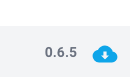

# hive-cli


Client for the Hive. Used in conjunction with [hive-config](https://github.com/caretech-owl/hive-config) and [hive-builder](https://github.com/caretech-owl/hive-builder).

## Quickstart

### Preparations: Setup Docker and login into GHCR

You need docker to be setup.
Follow the steps [described here](https://docs.docker.com/engine/install/) to install and configure the docker engine.
Furthermore, you need to be able to run docker as a user.
How this can be achieved for Linux is documented [here](https://docs.docker.com/engine/install/linux-postinstall/)

Login into GitHub with a [personal access token (ck)](https://github.com/settings/tokens) that only requires `read:packages` permissions.
Find more info [here](https://docs.github.com/en/packages/working-with-a-github-packages-registry/working-with-the-container-registry#authenticating-to-the-container-registry).

```shell
echo "<github_token>" | docker login ghcr.io -u USERNAME --password-stdin
```

### Setup hive-cli

Review [setup.sh](https://raw.githubusercontent.com/caretech-owl/hive-cli/refs/heads/main/setup.sh), download it and execute it or copy/paste the block below.

```shell
curl --proto '=https' --tlsv1.2 -LsSf https://raw.githubusercontent.com/caretech-owl/hive-cli/refs/heads/main/setup.sh | sh
```

#### Output

```shell
✅ Adding hive_cli hook to .bashrc ...
✅ Adding hive_cli hook to .zshrc ...
ℹ️ Please restart your shell or run 'source ~/.bashrc', 'source ~/.zshrc' or 'source ~/.bash_profile'
ℹ️ To use the function, run 'hive_cli'
```

### Running hive-cli

Make sure to open a new terminal after the initial setup.
Then just execute `hive_cli`:

```shell
hive_cli
```

#### Output

```shell
DOCKER_GID=991
Creating group _docker with GID 991
   Built hive-cli @ file:///workspace/hive-cli
Uninstalled 1 package in 0.58ms
Installed 1 package in 1ms
Poe => prod
DEBUG:hive_cli.repo:Fetching origin from https://github.com/caretech-owl/hive-config.git
DEBUG:hive_cli.docker:Running command: docker-compose -f compose/gerd.yml ps --format json
INFO:hive_cli.server:Starting server.
INFO:     Started server process [28]
INFO:     Waiting for application startup.
INFO:     Application startup complete.
INFO:     Uvicorn running on https://0.0.0.0:12121 (Press CTRL+C to quit)
```

`hive-cli` should now be available at https://0.0.0.0:12121 or https://localhost:12121 or https://127.0.0.1:12121 with a self-signed certificate.

### Troubleshooting

#### I get a warning when I open my browser!

Sine `hive-cli` uses a self-signed certificate, this is expected behaviour.
There are multiple ways to accept a self-signed certificate. With Chrome, just hit `advanced`, scroll down and `Proceed to 127.0.0.1 (unsafe)`.

#### How do I update the `hive_cli` shell script.

Just execute the inital setup again.

#### How do I update the `hive-cli` service

You can do this from inside the client.
When you seen a little cloud at the bottom right of the interface as seen below just click it and wait for the download of the new version. The icon will change once you should restart the service.



Sometimes this mechanism is broken though (since this is experimental software).
Your second option is to set the env variable `CLI_VERSION` and run `hive_cli` to force an update.

```shell
CLI_VERSION=latest hive_cli
# use CLI_VERSION=0.1.2 if you want to pull a specific version
```

## Concept

