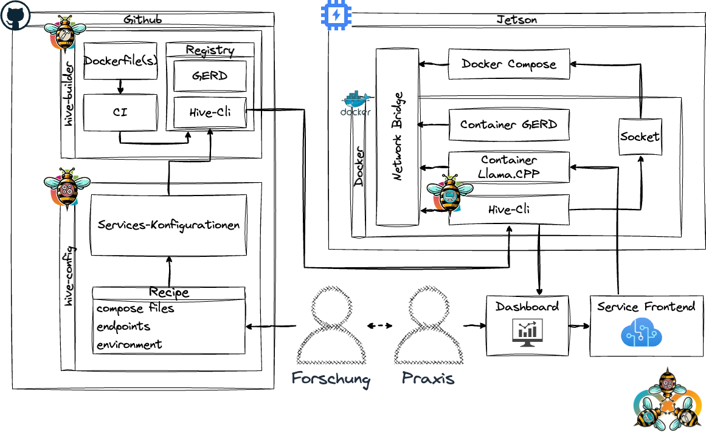

# hive-cli

Controls the CareTech OWL [hive](https://github.com/caretech-owl/hive).

## Quickstart

### Preparations: Login into GHCR

Login into GitHub with a [personal access token (ck)](https://github.com/settings/tokens) that only requires `write:packages` permissions.
Find more info [here](https://docs.github.com/en/packages/working-with-a-github-packages-registry/working-with-the-container-registry#authenticating-to-the-container-registry).

```shell
echo "<github_token>" | docker login ghcr.io -u USERNAME --password-stdin
```

### Setup, Pull and Run

Create a volume for persistent configurations and pass docker socket information to the container.
`hive-cli` cannot control docker correctly without access to it.

```shell
docker volume create hive
# Change when your docker socker is located somewhere else
DOCKER_SOCKET="/var/run/docker.sock"
DOCKER_GID=$(stat -c '%g' ${DOCKER_SOCKET})
docker run -p 443:443 -v $HOME/.docker:/workspace/.docker -v $HOME/.hive:/hive -v ${DOCKER_SOCKET}:/var/run/docker.sock -ti --rm -e UID=$UID -e GID=${DOCKER_GID} -v hive:/workspace/hive ghcr.io/caretech-owl/hive-cli
```

### Output

```shell
DOCKER_GID=991
Creating group _docker with GID 991
   Built hive-cli @ file:///workspace/hive-cli
Uninstalled 1 package in 0.58ms
Installed 1 package in 1ms
Poe => prod
DEBUG:hive_cli.repo:Fetching origin from https://github.com/caretech-owl/hive.git
DEBUG:hive_cli.docker:Running command: docker-compose -f compose/gerd.yml ps --format json
INFO:hive_cli.server:Starting server.
INFO:     Started server process [28]
INFO:     Waiting for application startup.
INFO:     Application startup complete.
INFO:     Uvicorn running on https://0.0.0.0:443 (Press CTRL+C to quit)
```

`hive-cli` should now be available at https://0.0.0.0 or https://localhost or https://127.0.0.1 with a self-signed certificate.

## Concept

